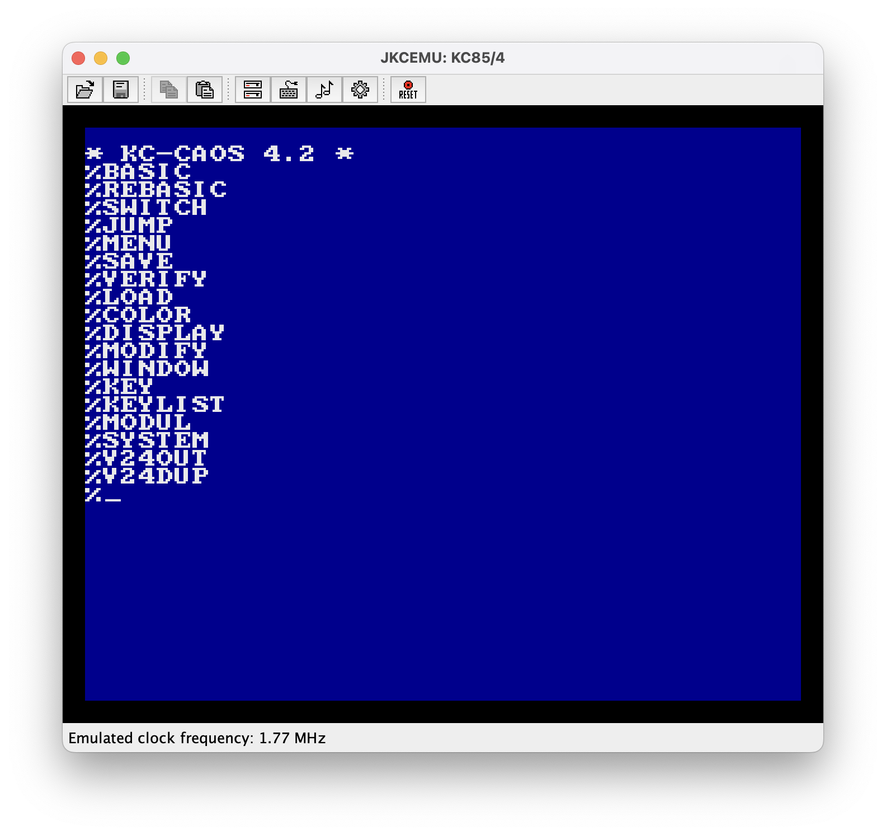
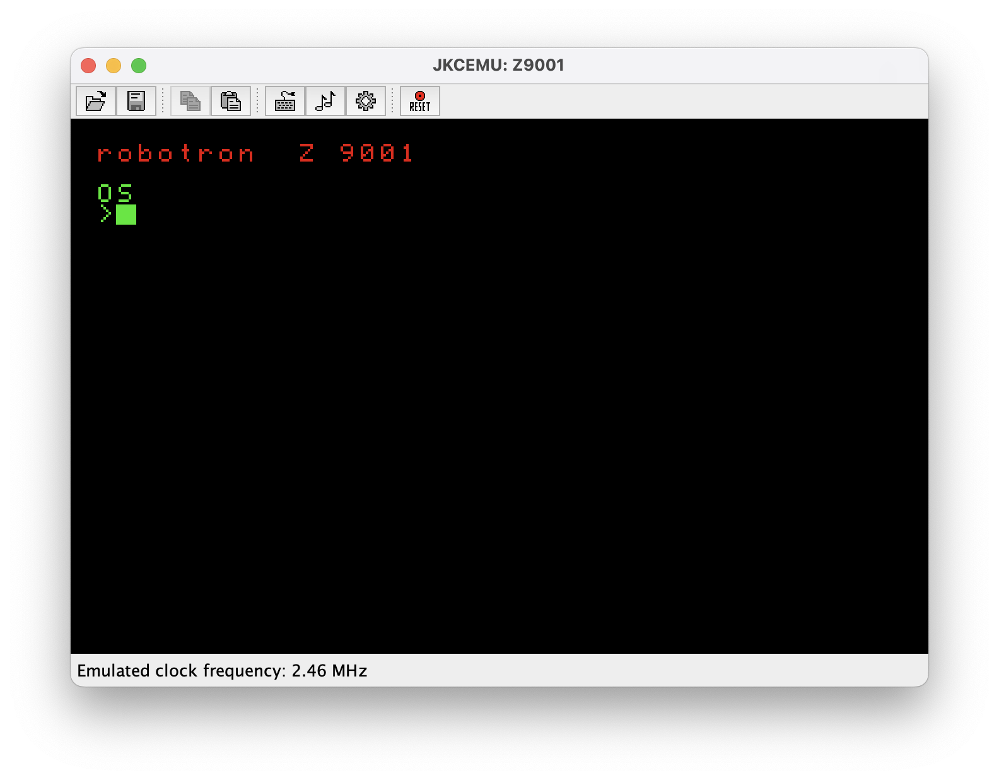
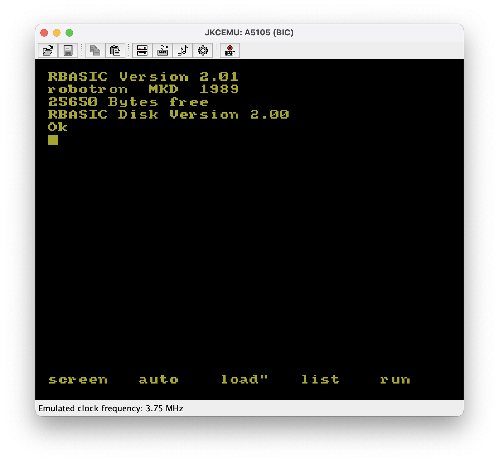

	

# JKCEMU Multilingual

  <a href="https://github.com/nwah/jkcemu-multilingual/releases/latest"><b>Download</b></a> ·
  <a href="http://www.jens-mueller.org/jkcemu">Original JKCEMU by Jens Müller</a> ·
  <a href="CONTRIBUTING.md">Contributing</a>

JKCEMU is a multi-system emulator for East German micro-computers like the Z 9001 and KC 85/3.

<table>
	<tr>
    <td align="center">KC 85/4</td>
    <td align="center">Z 9001</td>
    <td align="center">A5105 (BIC)</td>
  </tr>
  <tr>
    <td width="33%" valign="top"></td>
    <td width="33%" valign="top"></td>
    <td width="33%" valign="top"></td>
  </tr>
</table>

This is a fork of the <a href="http://www.jens-mueller.org/jkcemu">original German-language version</a> by Jens Müller which adds support for English (and hopefully other languages in the future).

The translation--including the very extension built-in documentation--was largely completed by AI tools, but is being gradually reviewed and improved. Corrections or improvements very welcome.

## Emulated systems

[A5105 (BIC, ALBA-PC 1505)](https://de.wikipedia.org/wiki/Bildungscomputer_robotron_A_5105) (de) ·
[AC1](https://de.wikipedia.org/wiki/AC1) (de) ·
[BCS3](https://hc-ddr.hucki.net/wiki/doku.php/homecomputer/bcs3) (de) ·
[C-80](https://de.wikipedia.org/wiki/C-80) (de) ·
[HC900, KC 85/2–5](https://en.wikipedia.org/wiki/KC_85) ·
[Hübler/Evert-MC](https://hc-ddr.hucki.net/wiki/doku.php/homecomputer/huebler) (de) ·
[Hübler-Grafik-MC](https://hc-ddr.hucki.net/wiki/doku.php/homecomputer/hueblergrafik) (de) ·
[KC compact](https://en.wikipedia.org/wiki/Amstrad_CPC#KC_compact) ·
[Kramer-MC](https://hc-ddr.hucki.net/wiki/doku.php/homecomputer/kramermc) (de) ·
[LC-80](https://en.wikipedia.org/wiki/LC80) ·
[LLC1](https://de.wikipedia.org/wiki/LLC1) (de) ·
[LLC2](https://de.wikipedia.org/wiki/LLC2) (de) ·
[NANOS](https://www.robotrontechnik.de/html/computer/nanos.htm) (de) ·
[PC/M (Mugler/Mathes-PC)](http://www.jens-mueller.org/jkcemu/pcm.html) (de) ·
[Poly-Computer 880](https://de.wikipedia.org/wiki/Polycomputer_880) (de) ·
[SC2 chess computer](https://de.wikipedia.org/wiki/Schachcomputer_in_der_DDR) (de) ·
[SLC1 chess and learning computer](https://hc-ddr.hucki.net/wiki/doku.php/homecomputer/slc1) (de) ·
[VCS80](https://de.wikipedia.org/wiki/VCS_80) (de) ·
[Z1013](https://en.wikipedia.org/wiki/Robotron_Z1013) ·
[Z 9001, KC 85/1, KC 87](https://en.wikipedia.org/wiki/Robotron_KC_87) ·
[ZX Spectrum](https://en.wikipedia.org/wiki/ZX_Spectrum)

Plus a [user-defined computer](http://www.jens-mueller.org/jkcemu/customsys.html) (de) that you configure yourself. Links marked (de) are in German.

## Download

Get the file for your system from the **[latest release](https://github.com/nwah/jkcemu-multilingual/releases/latest)**. The packages include their own Java runtime, so you don't need Java installed.

| System | File |
| --- | --- |
| macOS (Apple Silicon) | `JKCEMU-Multilingual-<version>-macos-arm64.dmg` |
| macOS (Intel) | `JKCEMU-Multilingual-<version>-macos-x64.dmg` |
| Windows | `JKCEMU-Multilingual-<version>-windows-x64.zip` |
| Linux (Debian, Ubuntu) | `jkcemu-multilingual_<version>_amd64.deb` |
| Linux (other) | `JKCEMU-Multilingual-<version>-linux-x64.tar.gz` |
| Any system with Java 17+ | `jkcemu.jar` (run with `java -jar jkcemu.jar`) |

Older versions are on the [releases page](https://github.com/nwah/jkcemu-multilingual/releases).

**First launch:** the packages aren't signed yet, so your system may warn you the first time.

- **macOS:** open the `.dmg` and drag the app to Applications. The first time, right-click the app and choose **Open**. If macOS says the app is damaged, run `xattr -dr com.apple.quarantine "/Applications/JKCEMU Multilingual.app"` in Terminal.
- **Windows:** unzip the folder anywhere and run `JKCEMU Multilingual.exe`. If SmartScreen appears, click **More info → Run anyway**.
- **Linux:** install the `.deb` with `sudo apt install ./jkcemu-multilingual_*.deb`, or extract the `.tar.gz` and run `JKCEMU Multilingual/bin/JKCEMU Multilingual`.

## Languages

Currently only English and German. If you would like to work on another translation, please see <a href="CONTRIBUTING.md">Contributing</a>.

## Credits

Credit for JKCEMU goes to Jens Müller. Please see the "Dank" section of [the original README](README-ORIGINAL.txt) for an extensive list of additional contributors and credits.
